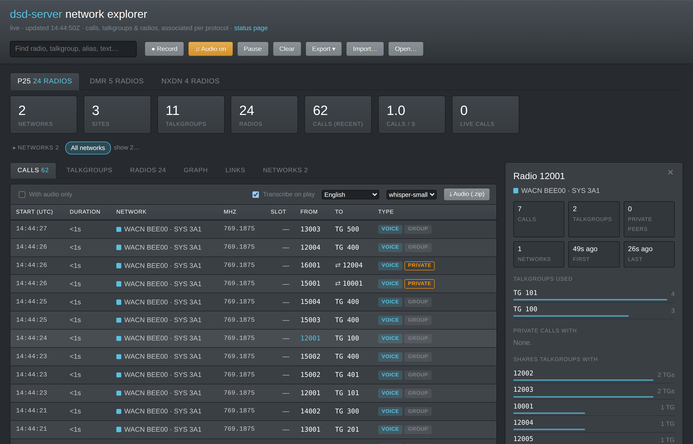
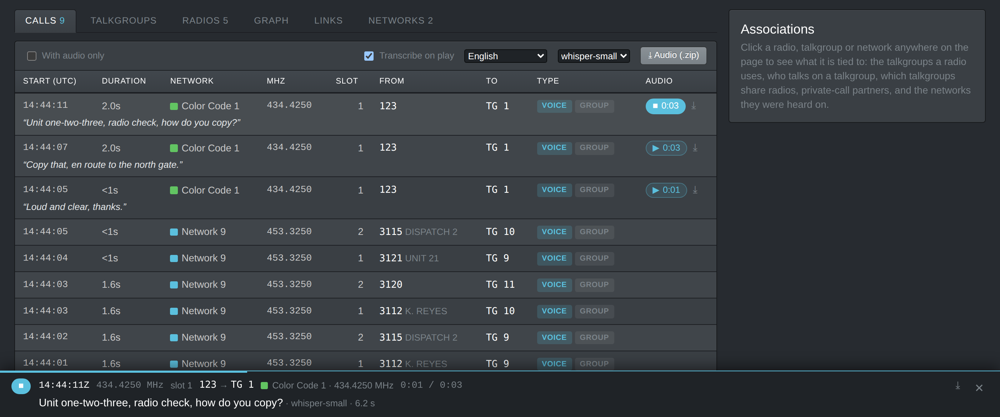
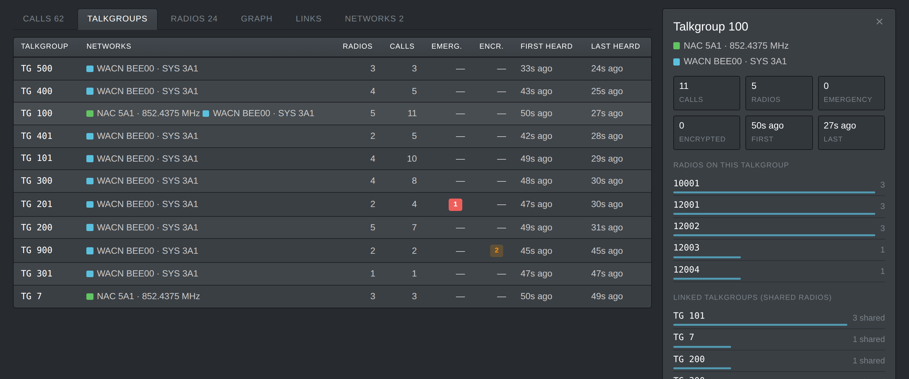
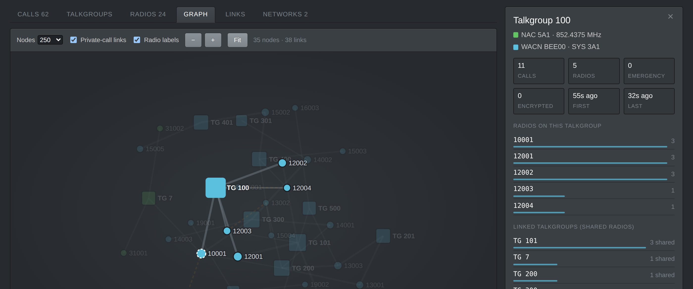
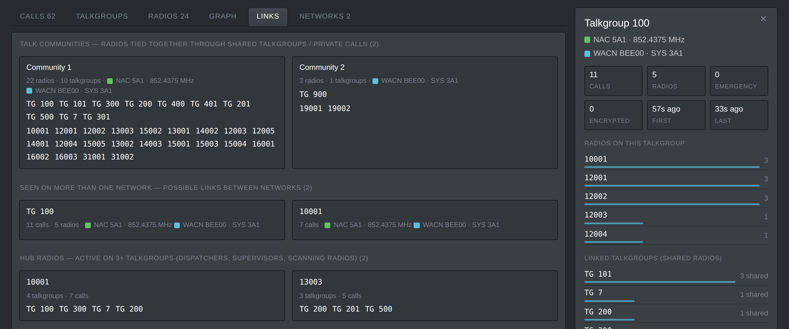
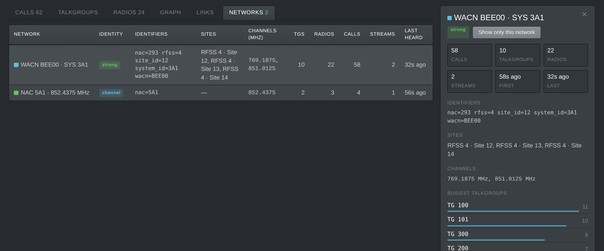
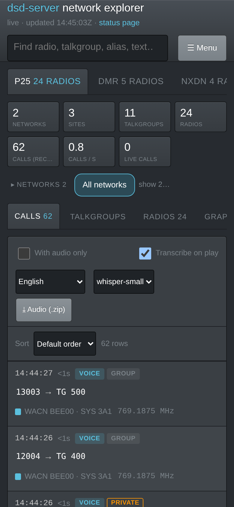
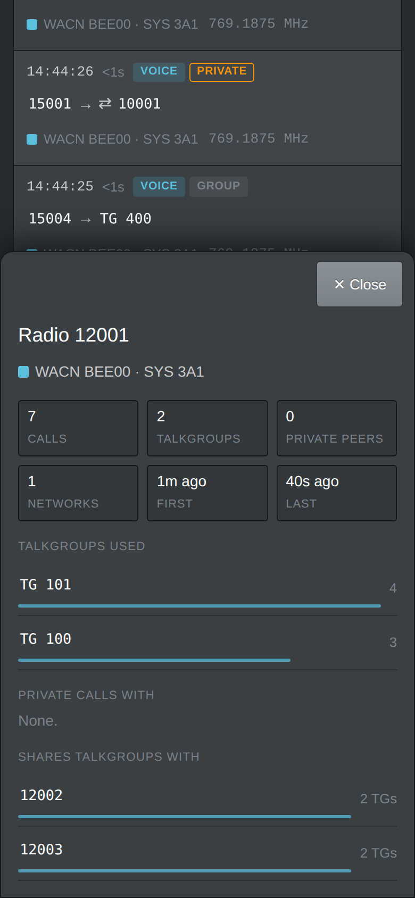

# Network Explorer — User Manual

The network explorer is the `/net` page of dsd-server. It turns everything the
server decodes into **calls, talkgroups, radios and networks, and how they are
connected**: who talks on which talkgroup, who calls whom privately, which
talkgroups share radios, and which systems a radio or talkgroup appears on.
It updates live, works on a PC, tablet or phone, and can save, reopen and
combine its data.

This manual covers using the page. [Appendix A](#appendix-a-how-associations-are-built)
explains how the associations are worked out, and [Appendix B](#appendix-b-per-protocol-notes)
what that means for each protocol. Server settings, HTTP endpoints and file
formats are in the [README](../README.md#network-explorer) and
[PROTOCOL.md](../PROTOCOL.md).

**Contents**

1. [Getting started](#1-getting-started)
2. [The page at a glance](#2-the-page-at-a-glance)
3. [Calls](#3-calls)
4. [Talkgroups and Radios](#4-talkgroups-and-radios)
5. [Graph](#5-graph)
6. [Links](#6-links)
7. [Networks](#7-networks)
8. [The details panel](#8-the-details-panel)
9. [Searching, filtering and sorting](#9-searching-filtering-and-sorting)
10. [Call audio](#10-call-audio)
11. [Speech-to-text](#11-speech-to-text)
12. [Saving, reopening and combining data](#12-saving-reopening-and-combining-data)
13. [Recording a session for troubleshooting](#13-recording-a-session-for-troubleshooting)
14. [Tablets and phones](#14-tablets-and-phones)
15. [Limits: what is kept, and for how long](#15-limits-what-is-kept-and-for-how-long)
16. [Troubleshooting](#16-troubleshooting)
17. [Settings reference](#17-settings-reference)
- [Appendix A: How associations are built](#appendix-a-how-associations-are-built)
- [Appendix B: Per-protocol notes](#appendix-b-per-protocol-notes)
- [Appendix C: Glossary](#appendix-c-glossary)

---

## 1. Getting started

1. Start dsd-server as usual and start one or more decode sessions from your
   client (DMR, P25, NXDN, dPMR, D-STAR, YSF, TETRA, EDACS / ProVoice,
   X2-TDMA). Paging (POCSAG / FLEX) is not shown in the explorer.
2. Open `http://<server>:<port>/net` in a browser — the same address and port
   as the status page (which links to it).
3. As traffic is decoded, a tab appears for each protocol and the views fill
   in. A channel with nothing on it, noise, or the wrong protocol selected
   leaves no trace.

**Send the channel frequency.** If your client's `start` message includes
`center_freq` (the tuner centre; the channel is `center_freq + freq_offset`),
the explorer labels and groups networks by channel (`Color Code 1 ·
434.4250 MHz`) instead of by session (`Color Code 1 · stream 3`). That is
much easier to read, and it lets reconnects, restarts and a second receiver
on the same channel join up. See [Appendix A.2](#a2-which-network-a-stream-is-on).

Nothing needs to be installed in the browser. The page is self-contained;
only the optional speech-to-text loads extra files, and only when used.

The screenshots in this manual use demo data (a simulated P25 system, NXDN and
DMR sites, and one DMR test call); transcripts in them are illustrative.

## 2. The page at a glance

From top to bottom:

| Part | What it does |
|---|---|
| **Status line** | `live · updated 12:34:56Z`, or `paused`, `file view`, `disconnected — retrying`. Links back to the status page. |
| **Search box** | Finds radios, talkgroups, aliases, SMS text and frequencies. Filters every view. See [section 9](#9-searching-filtering-and-sorting). |
| **Record** | Records everything the explorer receives, for replay and troubleshooting ([section 13](#13-recording-a-session-for-troubleshooting)). While on, the header shows the file name, its size and a **Download** link. |
| **♫ Audio** | Starts / stops recording each call's voice (off by default) — [section 10](#10-call-audio). Orange when on. |
| **Pause** | Freezes the whole page (no updates) until pressed again. |
| **Clear** | Forgets everything learned so far, and any imports. Asks first. |
| **Export ▾** | Saves what the explorer shows: explorer data (.json) or the association graph (.graphml). |
| **Import…** | Adds saved exports (e.g. from another receiver) to the live view. |
| **Open…** | Views saved exports offline, read-only (several files are merged). You can also drop files onto the page. |
| **Protocol tabs** | One per protocol with traffic (e.g. `DMR 62 radios · 1 live`). Protocols are never mixed: a DMR radio 1234 and a P25 radio 1234 are unrelated. |
| **Stat cards** | Networks, Sites, Talkgroups, Radios, Calls (recent), **Calls / s** (last minute; hover for the 10-minute average and the total) and Live calls — for the current protocol, network filter and search (not **With audio only**, which only shortens the Calls list). The protocol tab's "N live" counts all of its networks, so with a network filter or a search the two can differ. |
| **Network chips** | One [chip](#appendix-c-glossary) per network, with its call count. Click chips to pick one or more networks: the page shows only those. Click a picked chip again to drop it, or **All networks** to clear the filter. The list starts collapsed to **All networks** and the networks picked; click **▸ Networks** (or **show…** / **+N more…**) to open it, and again to close it. The browser remembers which. |
| **View tabs** | Calls · Talkgroups · Radios · Graph · Links · Networks. |
| **Details panel** | On the right (or a drawer on smaller screens): everything tied to the radio, talkgroup or network you click. |

On a narrow window the header's buttons fold into a **☰ Menu**.

*Figure 1: The explorer on a PC: header, protocol tabs, stat cards, the network chips (collapsed), the Calls view and, on the right, the details of the radio clicked (12001), with ✕ to deselect it.*

## 3. Calls

One row per call, newest first. A *call* is stitched together from many
decoder lines (sync, voice frames, call headers, aliases, SMS) — see
[Appendix A.3](#a3-from-decoder-lines-to-calls).

| Column | Meaning |
|---|---|
| **Start (UTC)** | When the call began. |
| **Duration** | How long it lasted; a pulsing green dot and running time while it is live. |
| **Network** | The network it was heard on (coloured swatch). When the MHz column already shows the frequency, it is left out of the name here; hover for the full name. |
| **MHz** | The channel frequency (when the client sent it). |
| **Slot** | TDMA timeslot where the decoder reports one (DMR's 1 or 2; P25 Phase 2); `—` otherwise. |
| **From** | The talking radio, with its talker alias when decoded. Click it for the radio's details. |
| **To** | The talkgroup (`TG 1234`), or `⇄ 5678` for a private (radio-to-radio) call. Click it for details. |
| **Type** | Badges: **VOICE** or **DATA**, **GROUP** or **PRIVATE**, **EMERGENCY**, **ENCRYPTED**, and **2 RX** when two receivers heard the same call (it is listed once). Hover for an explanation. |
| **Audio** | **▶ 0:12** plays the call's recorded voice, **⤓** downloads it — only when audio recording is on ([section 10](#10-call-audio)). |
| **Text** | SMS / text messages carried by the call. This column only appears when some call has text. |

A call's **transcript** (when speech-to-text is used) appears in quotes on its
own line under the row.

*Figure 2: DMR calls with recorded audio (▶ and ⤓), transcripts under their calls, and the now-playing bar at the bottom of the window.*

**Calls toolbar** (above the list):

- **With audio only** — lists only calls with recorded voice.
- **Transcribe on play**, the language and model lists — see
  [section 11](#11-speech-to-text).
- **⤓ Audio (.zip)** — downloads the audio of the calls listed
  ([section 10](#10-call-audio)).

The audio and transcription controls appear once audio recording is on or
some call has audio.

Up to 400 calls are shown at a time; the explorer keeps many more (5000 per
protocol by default) — narrow the list with the search box, a network chip or
a sort to see older ones.

## 4. Talkgroups and Radios

**Talkgroups**: one row per talkgroup — the networks it was heard on, how
many radios used it, its call count, emergency and encrypted call counts, and
when it was first and last heard.

**Radios**: one row per radio — its busiest talkgroups, how many talkgroups
and private-call partners it has, its networks, call count and when it was
last heard. Aliases are shown next to the id wherever the radio appears.

Click a row for its details ([section 8](#8-the-details-panel)). Click a
column header to sort.

*Figure 3: Talkgroups, with TG 100 selected: its radios and the talkgroups linked to it through shared radios.*

## 5. Graph

A live picture of who talks on what: **talkgroups** and **radios** are nodes,
a line joins a radio to each talkgroup it used, and a **dashed orange line**
joins two radios that made a private call. Node colour is the network; a
**white dashed ring** marks a radio or talkgroup seen on two or more networks;
a talkgroup's size grows with its calls.

- **Nodes** — how many of the busiest radios and talkgroups to draw (100 to
  1000). The note on the right says how many are shown.
- **Private-call links** and **Radio labels** — show or hide them.
- Drag a node to move it; drag the background to pan; scroll, pinch or use
  **− / +** to zoom; **Fit** brings everything back into view.
- Click a node to select it: its neighbours stay lit, everything else fades,
  and the details panel shows it.

*Figure 4: The graph with TG 100 selected. Squares are talkgroups, dots radios; the white dashed ring (10001) marks a radio seen on two networks.*

## 6. Links

The analysis view — evidence of how radios, talkgroups and systems relate:

- **Talk communities** — groups of radios tied together through talkgroups
  they share or private calls between them, largest first. A community is
  often one agency, fleet or work group.
- **Seen on more than one network** — talkgroups and radios heard on two or
  more networks. On weakly identified systems (see
  [Appendix A.2](#a2-which-network-a-stream-is-on)) this is how you spot
  that two "networks" are really the same system, or that systems are linked.
- **Hub radios** — radios active on three or more talkgroups: dispatchers,
  supervisors, scanning or patched radios.

*Figure 5: Links: talk communities, a talkgroup and a radio seen on two networks, and hub radios.*

## 7. Networks

One row per network the explorer has identified:

| Column | Meaning |
|---|---|
| **Network** | Its name: a system id (`WACN BEE00 · SYS 19E`, `Network 12`, `System 4A1`, `MCC 234 · MNC 14`), or a short code with a channel (`Color Code 5 · 460.0250 MHz`) or a stream (`Color Code 1 · stream 3`), or `Unidentified · …`. |
| **Identity** | How sure the identification is: **strong**, **channel**, **weak** or **unidentified** (hover for the meaning; [Appendix A.2](#a2-which-network-a-stream-is-on)). |
| **Identifiers** | The raw ids decoded (`cc=5  site_id=2  network_type=cap+` …). |
| **Sites** | Sites reported (`RFSS 1 · Site 3`, `Site 2`, `LA 1001` …), including neighbour sites announced by the system. |
| **Channels (MHz)** | Frequencies it was heard on. |
| **TGs / Radios / Calls** | Counts on this network. |
| **Streams** | How many decode sessions fed it (more than one = several receivers or reconnects). |

*Figure 6: Networks: a strongly identified P25 system (three sites, two channels) and a NAC heard on a known channel; the system's details on the right.*

## 8. The details panel

Click any radio, talkgroup or network — in a table, the graph, a chip or a
link — to open its details. Selecting something only shows its details and
highlights it (in the graph, its neighbours): it doesn't filter the lists or
the stat cards. To deselect, click the **✕** at the panel's top right, press
**Esc**, click the same item again, or click an empty part of the graph. On a
tablet or phone the details are a drawer: **Close** or Esc.

- **Radio**: calls, talkgroups, private peers and networks; **Talkgroups
  used** (by calls); **Private calls with**; **Shares talkgroups with** —
  other radios on its talkgroups, with how many in common; **Recent calls**,
  with ▶ where audio exists.
- **Talkgroup**: calls, radios, emergency / encrypted counts, networks;
  **Radios on this talkgroup**; **Linked talkgroups (shared radios)**;
  **Recent calls**.
- **Network**: **Show only this network** (or **Show all networks**); counts;
  identifiers; sites; channels; first and last heard; its busiest talkgroups
  and radios.

## 9. Searching, filtering and sorting

- The **search box** matches radio ids, talkgroup ids, aliases, SMS text and
  frequencies (e.g. `460.17`), in every view, including the graph and links.
- **Network chips** limit every view to the networks picked — one or several;
  each click adds or drops one. **Show only this network** in a network's
  details picks just that one; **All networks** clears the filter.
- **Click a column header** to sort by it; click again to reverse. Calls can
  be sorted by start, duration, frequency, slot, source, target and **Audio**
  (calls with audio first). On a phone a **Sort** menu replaces the headers.
- Filters and sorting also decide what **⤓ Audio (.zip)** saves.

## 10. Call audio

The explorer can keep each call's decoded voice so you can play it back.
**Off by default.** Turn it on with **♫ Audio** in the header, or start the
server with `DSD_NET_AUDIO=1`.

- **▶** plays a call (press again, or ■, to stop). The call playing stays in
  a **bar at the bottom of the window** — time, channel, who → whom,
  progress, **⤓** download and the transcript — however fast the list moves.
  **✕** closes it.
- **⤓** next to ▶ downloads the call's WAV (8 kHz mono), named after the
  call: `call_20261002T172931Z_434.4250MHz_s1_TG1_from_123.wav`.
- **⤓ Audio (.zip)** saves the audio of the calls **listed, in the order
  shown** (so filter, search or sort first), up to 25 MB, with a
  `calls.csv` of time, duration, network, MHz, slot, from (and alias), to,
  flags and any transcript. Handy for sending examples.

What gets recorded:

- One file per call. DMR's two timeslots are recorded separately; audio heard
  up to 1 s before the call was decoded is included; a call heard by two
  receivers is recorded once.
- **Never**: silence (no file without audible audio; recordings under 0.2 s
  are deleted), data calls (SMS, private data), and **encrypted calls**
  (unless the session has the key).
- Disk use is capped (1 GB by default, about 18 hours of speech); the oldest
  files go first, and calls with audio stay in the call list longest.
- Audio stays on the server that recorded it. Exports note which calls had
  audio, but an imported or merged view has none to play.

Rules on keeping intercepted communications differ from place to place;
check what applies to you before switching audio on.

## 11. Speech-to-text

With **Transcribe on play** ticked, playing a call also turns its speech into
text. The text shows in the bottom bar, then under the call in the list, and
goes into the audio zip's `calls.csv`.

- It runs **in your browser** (OpenAI's Whisper via Transformers.js); the
  server only provides the files. Someone has to fetch them onto the server
  once with `tools/get_asr_assets.sh` (see the README). Without them the bar
  says so and offers to load them from the internet instead — only if you
  choose to.
- **Language**: pick the spoken language (default English). "Detect
  language" guesses, poorly on short calls.
- **Model**: shown when the server has more than one. `small` (the default)
  is far more accurate on radio voice than `base` or `tiny`, but slower.
- **Speed**: the first call of a visit also loads the model (about 250 MB
  for `small`; cached afterwards). Then roughly 5–15 s per call on a desktop.
  Pages opened over plain `http://<server-ip>` run on one CPU thread and take
  about twice as long as HTTPS or `localhost`.
- **Accuracy**: good on clear speech, unreliable on short or garbled calls.
  Whisper sometimes invents text on silence or noise ("you", "Thanks for
  watching") or gets stuck repeating a phrase; the explorer drops those and
  shows "(no clear speech recognized)". Treat transcripts as a hint.
- Transcripts are kept in **your browser** (the last ~1000), not on the
  server — another browser starts without them. Replaying a transcribed call
  is instant.

## 12. Saving, reopening and combining data

- **Export ▾ → Explorer data (.json)** saves the networks, talkgroups,
  radios, every association with its counts, and the recent calls.
  **Open…** it later (or drop it on the page) to browse it offline, with
  every view working; times are shown relative to the export. A blue bar
  says you are in a file view; **Back to live** returns.
- **Export ▾ → Association graph (.graphml)** is for graph tools (Gephi,
  Cytoscape, yEd, networkx).
- **Open…** with **several files** shows them merged, read-only, with a
  report of what happened to each file and a **Save merged** link.
- **Import…** adds exports to the **live** view — e.g. other receivers'
  exports — shown together with the live data. A bar lists the imports, each
  removable (**✕**, or **Remove all**). New traffic keeps arriving on top;
  **Export** then saves the combined view.

When files are combined, talkgroups and radios join by id within a protocol;
networks join by their system id, or by code and channel. A call two
receivers both heard counts once (**2 RX**). The same data is never counted
twice: duplicate or overlapping exports are skipped or refused, with the
reason shown. Name each receiver with `DSD_SERVER_NAME` so its networks are
easy to tell apart. `net-merge` does the same from the command line.

## 13. Recording a session for troubleshooting

If something in the explorer looks wrong (phantom calls, calls cut short,
networks split or merged wrongly), a **recording** lets it be reproduced
exactly:

1. Click **Record** (accept the offer to clear first — the replay is then
   exact).
2. Let the problem happen, then click **Stop recording** and **Download**
   (`net_<UTC>.jsonl.gz`).
3. Send the file. `net-replay` rebuilds precisely what the explorer showed,
   and can show the state at any moment or produce an export from it.

A recording holds the decoder's output (not audio or IQ), compressed — around
half a megabyte per minute on a busy multi-channel server.

## 14. Tablets and phones

- Touch targets are finger-sized and the page scrolls as one.
- Below about 1050 px wide the details open in a **drawer** from the right
  (a **bottom sheet** on a phone) with a **Close** button.
- On a phone: the header's actions move into **☰ Menu**, calls are listed
  as **cards**, other tables become cards with a **Sort** menu, and the stat
  cards shrink to a strip.
- The graph has pinch-zoom and − / + buttons.
- Explanations that a mouse shows on hover (badges, identity levels, Calls /
  s) appear when tapped.

&nbsp;&nbsp;&nbsp;

*Figure 7: On a phone: calls as cards (left) and a radio's details in a bottom sheet (right).*

## 15. Limits: what is kept, and for how long

- Everything is in the server's memory: it resets when the server restarts
  or someone presses **Clear**. Export (or record) what you want to keep.
- **Calls**: the newest 5000 per protocol (`DSD_NET_MAX_CALLS`); calls with
  audio are dropped last. Talkgroup / radio / network counts and associations
  are kept for everything heard, not just the listed calls.
- **Radios / talkgroups / networks**: up to 3000 / 1500 / 200 per protocol;
  the least recently heard go first.
- When a session ends, a network that never carried a call (and radios known
  only through it) is dropped, unless another running session is still on it.

## 16. Troubleshooting

| Symptom | Likely cause / what to do |
|---|---|
| A session runs but nothing appears | The explorer only shows streams that decode real traffic. Check the status page: is the protocol right, is anything being decoded? |
| `Unidentified · …` network | No identity decoded yet (often at the start of a session, or on a quiet channel). It updates when one is heard. |
| One system appears as several `Color Code n · stream N` networks | The client didn't send the frequency, so short codes can't be trusted to join streams. Send `center_freq` in `start`. Meanwhile **Links → Seen on more than one network** shows the shared radios and talkgroups. |
| Many very short calls with no source | Usually decoder lines the explorer misread as calls. Make a **recording** ([section 13](#13-recording-a-session-for-troubleshooting)) and send it — that is how the Capacity Plus channel-status issue was found and fixed. |
| The list moves too fast to read | The header's **Pause** freezes the page; or narrow the list with the search box or a network chip. |
| ▶ buttons don't appear | Audio recording is off — press **♫ Audio**. Encrypted and data calls never have audio. |
| "Speech-to-text needs its files on the server" | Run `tools/get_asr_assets.sh` on the server (or point `DSD_NET_ASR_DIR` at a copy), then reload the page. |
| Transcripts are slow | Open the page over HTTPS or as `localhost`, use a faster PC, or pick `base` in the model list (faster but much less accurate). |
| Transcript is wrong | Try the right language, or `small` / `small.en` if a smaller model is selected. Short or poor-signal calls are often beyond any model. |

## 17. Settings reference

Server environment variables that affect the explorer (details in the README):

| Variable | Default | Effect |
|---|---|---|
| `DSD_SERVER_NAME` | host name | This receiver's name in exports and merged views. |
| `DSD_NET_MAX_CALLS` | 5000 | Calls kept per protocol. |
| `DSD_NET_FREQ_STEP_HZ` | 1250 | Channel raster frequencies are snapped to. |
| `DSD_NET_CHANNEL_MERGE` | (merge) | `receiver` keeps different receivers' channel networks apart when merging. |
| `DSD_NET_AUDIO` | off | `1` records call audio from startup. |
| `DSD_NET_AUDIO_DIR` | `net_audio/` in the log dir | Where call audio goes. |
| `DSD_NET_AUDIO_MAX_MB` / `DSD_NET_AUDIO_MAX_AGE_H` | 1024 / none | Audio disk cap and maximum age. |
| `DSD_NET_ASR_DIR` | `net_asr/` in the log dir | Speech-to-text files (`tools/get_asr_assets.sh`). |
| `DSD_NET_ASR_MODEL` / `DSD_NET_ASR_LANG` | most accurate present / english | Default speech model and language. |
| `DSD_NET_LOG` | off | `1` records from startup. |
| `DSD_NET_LOG_DIR` / `DSD_NET_LOG_MAX_MB` | IQ-capture dir, else working dir / 1024 | Where recordings go, and their size cap. |

---

## Appendix A: How associations are built

This is a high-level description of what the explorer does with the decoder's
output. It works the same way for every protocol; [Appendix B](#appendix-b-per-protocol-notes)
covers the differences.

### A.1 Inputs

Each decode session is a **stream**: one receiver channel decoding one
protocol. The decoder (dsd-fme, DSDcc or the TETRA decoder) prints lines for
sync bursts, call headers, voice frames, talker aliases, SMS, and system
broadcasts. dsd-server parses each line into an event — its kind (sync,
call, voice, data, message …), slot, source id, target id, alias, text, and
identity tokens such as a color code or system id. The explorer is fed every
event of every stream, including lines clients never see.

Everything is kept **per protocol family**. Ids are only ever compared within
a family.

### A.2 Which network a stream is on

Identity and calls arrive on **different lines**: a call header carries only
source and target, while the system's identity comes from sync bursts or
system broadcasts. So each stream remembers the identity it has decoded so
far, and each call is credited to its stream's current network. Identity comes
in three strengths:

- **Strong** — a real system id that is unique in practice: P25 WACN + System
  ID, DMR network id (Tier III / Capacity Max), NXDN system code, TETRA
  MCC + MNC, EDACS system id. Every stream that hears the same strong id is the
  same network, whichever receiver or session it came from.
- **Weak** — a short code that unrelated systems routinely share: DMR color code
  (16 values), P25 NAC, NXDN RAN, dPMR channel code, D-STAR repeater callsign,
  YSF downlink id. A weak id alone is **not** treated as a network identity:
  each stream gets its own network (`Color Code 1 · stream 3`), and shared
  radios and talkgroups appear under **Links** as evidence instead of being
  merged silently.
- **Channel** — a weak id (or none) **plus the channel frequency** sent by the
  client. A short code on one channel is in practice one repeater or
  conventional channel, so every stream on that frequency with that code
  shares one network (`Color Code 1 · 434.4250 MHz`). A stream on a known
  channel with nothing decoded yet is `Unidentified · 434.4250 MHz`.

Refinements:

- **Upgrades**: a stream's identity can grow (unidentified → NAC → SYS →
  WACN/SYS). Its earlier, less specific network is then folded into the new one
  when only that stream fed it, or when the new identity strictly contains the
  old.
- **Retunes**: a *different* value for an identifying id (another color code,
  another system id) means the stream is now on another network; it starts its
  identity over.
- **Placeholders**: weak codes must be seen **twice in a row** before they are
  believed (dsd-fme prints placeholders such as `Color Code=00` at the start of
  a burst). Strong ids, from decoded control messages, are taken at once.
- **Neighbour sites**: adjacent / neighbour-site broadcasts add a site to the
  network but never change the stream's own identity or site.
- **Sites**: site ids (P25 RFSS/Site, DMR Site, NXDN site code / location,
  TETRA location area) are recorded as the network's sites, not as separate
  networks.

### A.3 From decoder lines to calls

A call is assembled from many events:

1. **Which call an event belongs to.** Calls are tracked per stream, per
   **slot** and per **target**. An event with a target joins the open call on
   that slot and target; one without a target joins the slot's latest call.
   This keeps two DMR timeslots apart, and keeps several grants interleaved on
   a control channel apart.
2. **New call.** A call starts at a call header, voice or data event with a
   source or target. A sync burst alone never starts one. A new call on a TDMA
   slot ends the previous call on that slot. A **new talker** (different
   source) on the same target starts a new call.
3. **End of call.** A call ends after **4 seconds** without events, or when
   replaced as above.
4. **What it collects.** Source and target (filled in as they are decoded —
   the same call is recognised with or without a slot marker, or before its
   target is known), talker alias, SMS text, and flags: **voice** (voice
   frames / voice sync), **data** (data headers, SMS, UDT), **emergency**,
   **encrypted** (a non-clear algorithm id or an encryption flag) and
   **private**.
5. **Private calls.** A call is private (radio → radio) when the decoder marks
   it so: a unit-target flag, or "Private", "Unit to Unit", "Individual",
   "I-Call" or "U2U" on its lines. A call first counted as a group call and
   then found to be private has its association moved from the talkgroup to
   the radio pair.
6. **Ignored.** Lines that failed their error check (CRC/FEC) are dropped —
   their ids are unreliable. System broadcasts (identity, LCW, status) never
   start calls, only refine the call in progress on their slot. **Rosters** —
   e.g. Capacity Plus channel status (`Private or Data Call(s) - LSN 01: TGT
   17434; …`), which lists traffic on the site's *other* channels — never
   start, end or extend calls.

### A.4 Counting associations

When a call has both a source and a target it is **counted once**:

- **Group call**: radio → talkgroup. The radio's talkgroup count and the
  talkgroup's radio count go up; both are marked as heard on the call's
  network.
- **Private call**: radio ↔ radio. Both radios get the other as a **private
  peer**.
- The network's call count, the radio's and talkgroup's call counts and
  last-heard times, and the **Calls / s** rate are updated.

The derived views come from these counts:

- **Radios sharing talkgroups** (radio details): radios counted on the same
  talkgroups.
- **Linked talkgroups** (talkgroup details): talkgroups whose radios also use
  this one.
- **Talk communities** (Links): connected groups of radios and talkgroups,
  through group and private calls.
- **Seen on more than one network** (Links): radios or talkgroups counted on
  two or more networks.
- **Hub radios** (Links): radios on three or more talkgroups.

### A.5 One call heard twice (2 RX)

Two receivers often hear the same call — a P25 control channel's grant and the
voice channel, two sites of one system, or two receivers on one repeater. When
a call from a different stream has the **same network, source, target and
group/private type** and is still running (within 4 s), it is the same call:
the second is folded into the first (flags, alias and text combined, earliest
start, latest end) and counted once, marked **2 RX**. Only one audio recording
is kept.

### A.6 Combining exports

Merging (Open with several files, Import, `net-merge`) applies the same rules
across files: talkgroups and radios join by id; networks join by strong id, or
by code + channel (unless `DSD_NET_CHANNEL_MERGE=receiver`). A weak id with no
channel stays per receiver (`… · stream 3 · rx-north`). Calls are folded as in
A.5 across files. Each export records its server run and the time span it
covers, so the same data is never counted twice.

### A.7 Audio

Decoded voice arrives per stream and per slot (DMR's two slots are the left and
right channels of dsd-fme's audio). It goes to the open call on that stream and
slot. Audio heard just before a call is decoded (up to 1 s) is held and put at
the start of the call. Data-only calls never get audio. While only one DMR slot
carries voice, dsd-fme copies that voice to both channels. The copy goes to
the slot that last showed voice (a voice frame or voice burst), not to the
slot of the last line. On a Capacity Plus or trunked channel the other slot
sends control bursts nonstop, and following those would cut holes in the
call. A copy that lands on a data call on the other slot is given back to the
voice call.
Encrypted calls are not recorded (unless the session has the key).

---

## Appendix B: Per-protocol notes

| Protocol | Strong identity | Weak identity | Sites | Ids (radio / target) | Slots |
|---|---|---|---|---|---|
| **DMR** | Network id (Tier III, Capacity Max; with network type) | Color code (0–15) | Site id | Radio id → talkgroup or radio | 2 (TDMA) |
| **P25** | WACN + System ID (or System ID alone) | NAC (12-bit) | RFSS + Site | Unit id → talkgroup or unit | Phase 2: 2 |
| **NXDN** | System code | RAN | Site code / location id | Unit id → group or unit | — |
| **TETRA** | MCC + MNC | Colour code | Location area (LA) | SSI → called SSI (group or individual) | — |
| **dPMR** | — | Channel code | — | Radio id → talkgroup | — |
| **D-STAR** | — | Repeater callsign (RPT1) | — | Callsign → destination callsign | — |
| **YSF** | — | Downlink id | — | Callsign → destination | — |
| **EDACS / ProVoice** | System id | — | — | Source → group (or individual) | — |
| **X2-TDMA** | — | — | — | Radio id → talkgroup | as decoded |

**DMR**

- Tier II conventional and repeaters usually give only a **color code**. Send
  the frequency so each repeater becomes a channel network; otherwise each
  stream is its own network.
- Tier III trunking and Capacity Max give a **network id** (strong).
  Capacity Plus reports its site and type (`network_type=cap+`, `site_id`)
  as identifiers of the color-code network.
- The two timeslots are separate calls; a sync line's slot is carried onto
  the call lines that follow it when they don't name a slot.
- Capacity Plus **channel-status rosters** (`Bank One … Private or Data
  Call(s) - LSN …`) list traffic on the site's other channels and are not
  calls (Appendix A.3).
- SMS: a data preamble, data header and the decoded text become **one** data
  call carrying the text. Talker aliases are attached to the call and the
  radio.

**P25**

- A control channel broadcasts **WACN / System ID / RFSS / Site**. A voice or
  conventional channel may only show the **NAC**. Because a NAC is 12 bits
  (more distinctive than a color code), a NAC-only stream is attached to the
  known WACN/SysID network with that NAC — when exactly one has it.
- A control-channel grant and the voice channel carrying it are the same call:
  they are folded into one (**2 RX**).
- Encryption is taken from the algorithm id (anything other than clear /
  0x80).

**NXDN**

- **System code** (from control channel broadcasts) is strong; the **RAN**
  alone is weak. Site code and location id become sites.

**TETRA**

- **MCC + MNC** (from the cell's broadcasts) identify the network; **location
  area** is the site. The calling SSI is the radio; the called SSI (a group or
  an individual) is the target — reported by the tetmon decoder path; the
  tetra-kit path reports only the caller, so its calls show no target and
  aren't counted as associations. Encryption comes from the decoder's
  encryption flags.

**dPMR**

- Only a **channel code** — a weak id, so send the frequency to join streams.

**D-STAR and YSF**

- Ids are **callsigns**, not numbers: the source callsign is the radio, the
  destination (often `CQCQCQ` = everyone) is the "talkgroup".
- The repeater callsign (D-STAR RPT1) or downlink id (YSF) is the network's
  weak identity, believed at once. Radio text / messages are attached to the
  call. A simplex D-STAR call (`RPT 1: DIRECT`) has no repeater, so its
  network is just the channel.
- A D-STAR call picked up after its header shows a blank source
  (`SRC: ... INTERRUPTED`). It's still a call to its destination: it counts
  for that "talkgroup" and the channel, with no radio. dsd-fme builds that log
  frame payloads print the header on every voice frame (`AMBE ... DST:`),
  and those are read too.

**EDACS / ProVoice**

- The **system id** is strong. The caller is the radio and the group (or,
  for an individual call, the callee) the target; channel (LCN), AFS and LID
  numbers are kept as identifiers. This parsing follows dsd-fme's EDACS /
  ProVoice output formats but hasn't yet been checked against a live
  signal.

**X2-TDMA**

- No identity is decoded; networks are `Unidentified`, by channel when the
  frequency is known.

---

## Appendix C: Glossary

| Term | Meaning |
|---|---|
| **Stream** | One decode session: one receiver channel, one protocol. |
| **Network** | A radio system as the explorer identifies it (Appendix A.2). |
| **Chip** | A small rounded, clickable label on the page, like a tag: each network chip names one network (with its colour swatch and call count). A highlighted chip is picked; click it again to drop it. |
| **Strong / weak / channel identity** | How a network was identified: a unique system id / only a short shared code / a short code on a known frequency. |
| **Talkgroup (TG)** | A group address many radios listen to. |
| **Private call** | Radio-to-radio (unit-to-unit, individual) call; `⇄` in the To column. |
| **Slot** | A TDMA timeslot: DMR has 2 per channel, TETRA 4. Each carries its own call. |
| **2 RX** | One call heard by two receivers / streams, listed once. |
| **Talker alias** | A name the radio sends with its id (DMR, P25). |
| **Color code / NAC / RAN** | Short codes that keep co-channel systems apart (DMR / P25 / NXDN). Not unique. |
| **WACN / System ID** | P25's wide-area and system identifiers. |
| **LSN** | Logical slot number: a channel and slot on a Capacity Plus site. |
| **Export** | The explorer's gathered data saved as a file (re-openable). |
| **Recording** | The explorer's raw input saved for exact replay (troubleshooting). |
